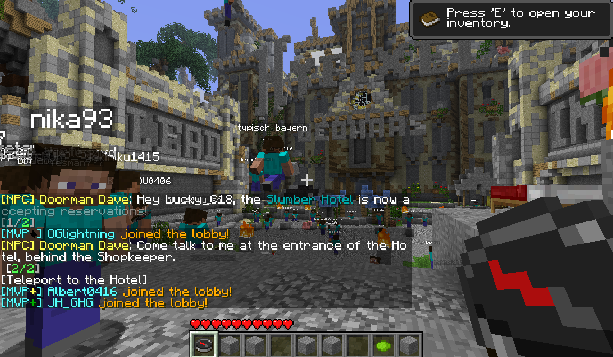

# Beta2Release

Beta2Release is an application that allows connecting to modern servers (version 1.12.2) from a Beta 1.7.3 client. 
This is particularly useful for players who want to experience modern server features while using the nostalgic Beta 1.7.3 client.

## Getting the Latest Build

You can download latest build from our [Jenkins Server](https://ci.mzga.dev/job/Beta2Release/)

## Configuration Files

Upon running the program, a `config.toml` file will be generated. This file allows you to configure various settings such as ports, IPs, and the version.
The program also creates a `mappings.json` file. This file is used for protocol translation customization.

## Contribution

We welcome contributions! If you encounter any issues or have suggestions for improvements, feel free to open an issue or a pull request on GitHub.

---

Enjoy playing on modern servers with your favorite Beta 1.7.3 client!

For any further assistance or questions, please join our [Discord server](https://discord.gg/v6xsRdc).

### WARNING !!!
Don't use this on servers that don't allow it!
Well, you can, but don't be surprised if you get banned

We're not responsible for any bans or other consequences that may occur from using it

